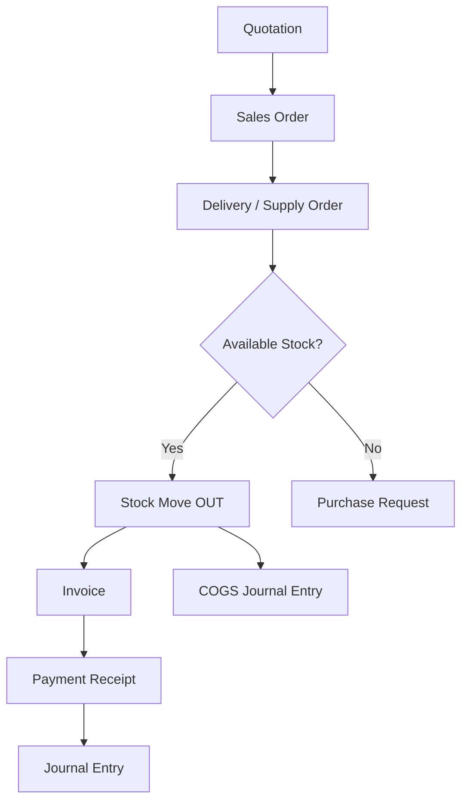
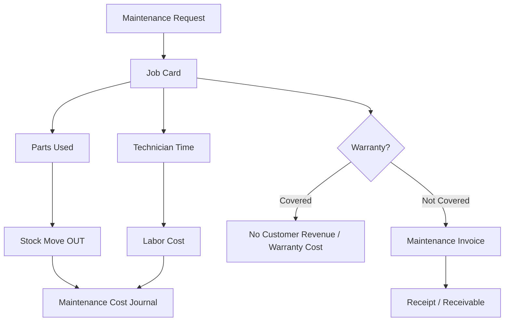

# Generator ERP Architecture

هذه الوثيقة هي مرجع البناء الرسمي للنظام. أي تطوير جديد يجب أن يلتزم بها قبل إضافة واجهات أو شاشات.

## الهدف

بناء Operational ERP خاص بشركة مولدات وصيانة، وليس نظام عام لكل الشركات. مركز النظام هو:

- القيود اليومية.
- دفتر الأستاذ.
- حركة المخزون وطبقات الكلفة.
- دورة المستند.
- سجل التدقيق والصلاحيات.

الفاتورة ليست أصل النظام؛ الفاتورة مستند ينتج عنه ترحيل محاسبي وحركة تشغيلية.

## Core Modules

| Module | الوصف | المصدر الحقيقي |
| --- | --- | --- |
| Accounting | قيود، حسابات، دفتر أستاذ، ميزان مراجعة، إقفالات | `journal_entries`, `journal_lines`, `accounts` |
| Inventory | مخازن، أصناف، حركات، طبقات كلفة، سيريال | `items`, `stock_moves`, `inventory_layers`, `serial_numbers` |
| CRM | العملاء، تصنيف قطاع عام/خاص، أفراد/شركات | `customers` |
| Maintenance | كروت صيانة، ضمان، ساعات تشغيل، قطع مستخدمة | `maintenance_job_cards`, `stock_moves`, `journal_entries` |
| HR | موظفون، رواتب، أجور فنيين | سجلات HR + قيود مصروفات |
| Purchasing | طلب شراء، مشتريات خارجية، شحن، تخليص، بضاعة بالطريق | مستندات شراء + قيود + مخزون |
| Sales | عرض سعر، أمر بيع، تجهيز، فاتورة، قبض | مستندات بيع + قيود + أوامر تجهيز |

## قواعد غير قابلة للكسر

1. لا تخزن الرصيد النهائي داخل الحساب كمصدر حقيقة.
2. لا تحذف أي حركة مالية أو مخزنية بعد اعتمادها.
3. التصحيح المالي يكون بقيد عكسي أو مستند إلغاء.
4. كل عملية مالية يجب أن تولد Journal Entry متوازن.
5. كل عملية مخزنية يجب أن تولد Stock Move.
6. كل تغيير حساس يجب أن يولد Audit Log.
7. لا ترحيل داخل فترة مالية مغلقة.
8. أي نقص مخزون لا يتحول إلى إخراج وهمي؛ يولد طلب شراء.
9. المولد ليس مجرد منتج؛ هو جهاز/أصل تشغيلي له Serial وضمان وصيانة وساعات تشغيل.

## Document Workflow



دورة البيع العملية الحالية:

1. إنشاء فاتورة أو أمر بيع.
2. ترحيل قيد استحقاق على العميل مقابل إيراد المبيعات.
3. قبض نقدي/مصرفي حسب رغبة الزبون.
4. إنشاء أمر تجهيز إلى أمين المخزن.
5. إذا المادة متوفرة: إخراج مخزني + قيد تكلفة.
6. إذا المادة غير متوفرة: طلب شراء للنواقص.

## Accounting Engine

الجداول الأساسية:

- `accounts`: دليل الحسابات فقط.
- `journal_entries`: رأس القيد.
- `journal_lines`: سطور القيد.
- `fiscal_periods`: فترات مالية مفتوحة/مغلقة.
- `cost_centers`: مراكز الكلفة.
- `analytic_accounts`: حسابات تحليلية.

قاعدة الرصيد:

```text
Account Balance = SUM(debit_base) - SUM(credit_base)
```

للإيرادات والمطلوبات وحقوق الملكية يعرض الرصيد بطبيعته الدائنة في التقارير، لكن المصدر يبقى سطور القيود.

## Inventory Engine

الجداول الأساسية:

- `items`: تعريف الصنف، وليس المصدر الوحيد للكمية.
- `stock_moves`: كل دخول/خروج/تسوية مخزن.
- `inventory_layers`: طبقات كلفة FIFO أو Average لاحقا.
- `serial_numbers`: تتبع المولدات والسيريالات.

قواعد المخزون:

- لا يكفي أن يكون عند الصنف `qty`.
- كل دخول يولد `stock_moves: IN` وطبقة كلفة.
- كل خروج يولد `stock_moves: OUT` ويستهلك من الطبقات.
- إخراج المولد أو القطعة يجب أن يرتبط بمستند: أمر تجهيز، صيانة، بيع، أو تسوية.

## Generator Asset Lifecycle

المولد عند البيع أو الصيانة يجب أن يحمل:

- رقم سيريال.
- رقم محرك إن وجد.
- البراند: Perkins / Baudouin / Isuzu Chinese.
- السعة.
- تاريخ بداية الضمان.
- سنوات الضمان.
- ساعات الضمان.
- قاعدة انتهاء الضمان: السنوات أو الساعات، أيهما أقرب.
- سجل صيانة.
- عقود صيانة مرتبطة.
- قطع غيار مستخدمة عليه.

## Maintenance Workflow



الصيانة ليست ملاحظة. الصيانة مستند تشغيلي يربط الزبون، المولد، الفني، القطع، التكلفة، الإيراد، والضمان.

## Multi Currency

العملة الأساسية للتقارير: IQD.

كل قيد يجب أن يدعم:

- `currency`
- `exchange_rate`
- `debit`
- `credit`
- `debit_base`
- `credit_base`

الدولار لا يعالج كنص داخل الملاحظة. يجب أن يظهر في القيود وسندات القبض والدفع والمشتريات.

## Security And Controls

الصلاحيات يجب أن تفصل بين:

- Create
- Edit
- Post
- Approve
- Cancel
- Reverse
- Export
- View Sensitive Reports

أي مستخدم لا يملك صلاحية `Post` لا يستطيع ترحيل قيد أو حركة مخزنية مؤثرة.

## Phase Plan

### Phase 1 Core

- Authentication.
- Permissions.
- Chart of Accounts.
- Journals.
- General Ledger.
- Trial Balance.
- Inventory Engine.
- Audit Log.
- Backup.

### Phase 2 Operations

- Sales Orders.
- Purchasing.
- Maintenance Job Cards.
- Warranty.
- Contracts.
- Payroll.
- Fixed Assets.
- Smart Dashboard backed by cached reports, not direct heavy table scans from the UI.

### Phase 3 Scale

- Multi-branch.
- Multi-warehouse.
- BI dashboards.
- API.
- Mobile app.
- External backup/versioning.

## Current Implementation Notes

المشروع الحالي يحتوي على PostgreSQL وجداول الأساس التالية:

- `accounts`
- `journal_entries`
- `journal_lines`
- `items`
- `stock_moves`
- `inventory_layers`
- `serial_numbers`
- `maintenance_job_cards`
- `fiscal_periods`
- `role_permissions`
- `approvals`
- `audit_log`
- `report_cache`

أي شاشة جديدة يجب أن تسأل أولاً:

1. ما المستند الذي تمثله؟
2. هل يولد قيد؟
3. هل يولد حركة مخزون؟
4. هل يحتاج موافقة؟
5. هل يتأثر بالإقفال؟
6. ما التقرير الذي سيظهر فيه؟
